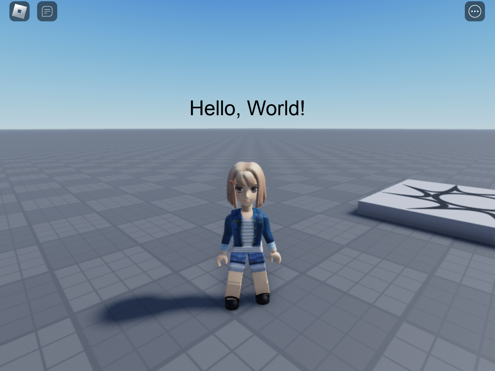

# Hello, World!

Now that Dec is installed, let's build a simple Roblox UI.

First create a LocalScript under `game.StarterPlayer.StarterPlayerScripts`

Add an import and `--strict` mode directive and import to utilize Dec's library and types: 

```lua
--!strict
local Dec = require(game.ReplicatedStorage.Packages.Dec)
```

Paste the following code below the import statement:

```lua
-- Create our Dec application
local App = Dec.New("ScreenGui", {ResetOnSpawn = false}, {
    HelloLabel = Dec.New("TextLabel", {
        Text = "Hello, World!",
        TextSize = 24,
        BackgroundTransparency = 1, 
        TextColor3 = Color3.fromHex("000"),
        Position = UDim2.fromScale(0.5, 0.25),
        AnchorPoint = Vector2.new(0.5, 0.5),
    })
})

-- Render our Dec application under PlayerGui when it loads
local PlayerGui = game.Players.LocalPlayer:WaitForChild("PlayerGui")
local root = Dec.Root(PlayerGui)
root:Render(App)
```

A simple Dec application will render upon playtesting in Roblox Studio!



For a little flavor and a sneak peak at how Dec works, let's add a rainbow glow
to the Hello World text! Paste the following code into your LocalScript:

```lua
--!strict
local Dec = require(game.ReplicatedStorage.Packages.Dec)

-- Create a color shift observable
local timer = Dec.Stopwatch(math.huge)
timer:Start()

-- Create our Dec application
local App = Dec.New("ScreenGui", {ResetOnSpawn = false}, {
    HelloLabel = Dec.New("TextLabel", {
        Text = "Hello, World!",
        TextSize = 24,
        BackgroundTransparency = 1, 
        TextColor3 = timer:Map(function(currentTime)
            return Color3.fromHSV((currentTime / 5) % 1, 1, 1)
        end),
        Position = UDim2.fromScale(0.5, 0.25),
        AnchorPoint = Vector2.new(0.5, 0.5),
    })
})

-- Render our Dec application under PlayerGui when it loads
local PlayerGui = game.Players.LocalPlayer:WaitForChild("PlayerGui")
local root = Dec.Root(PlayerGui)
root:Render(App)
``````

<video width="100%" controls autoplay loop>
  <source src="../../helloRainbow.mov" type="video/mp4" />
  Your browser does not support HTML Videos.
</video>